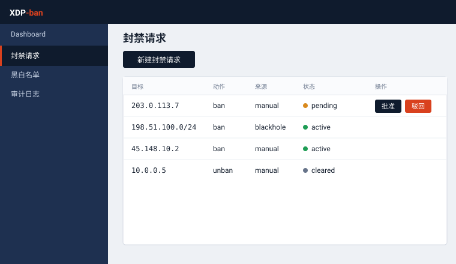
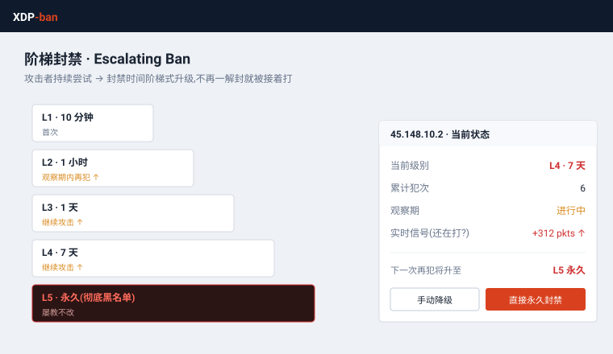
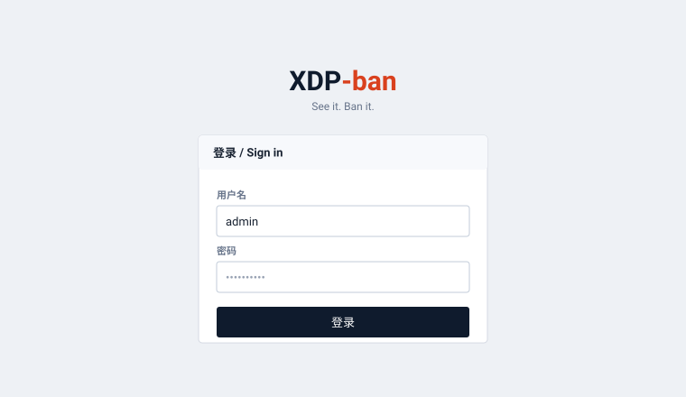
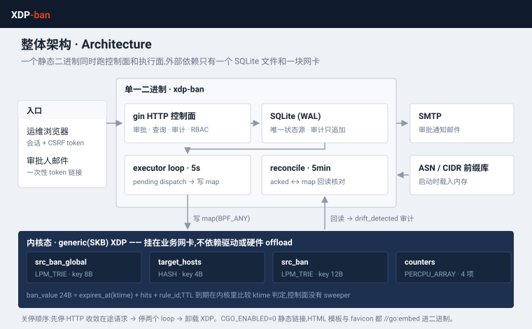
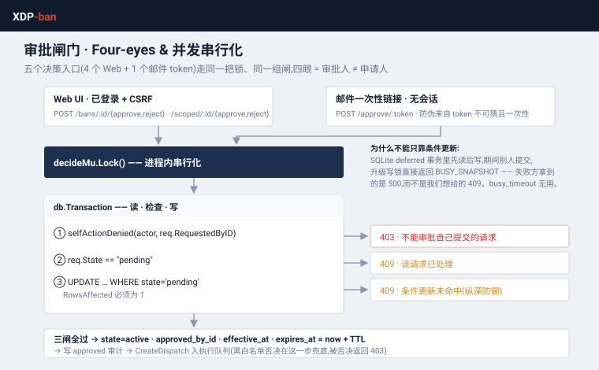
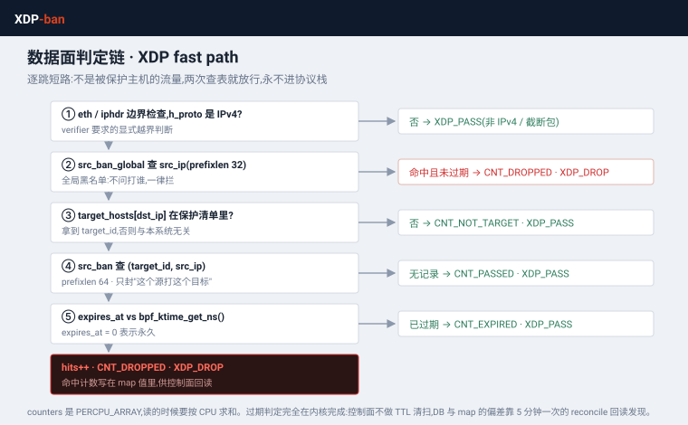

<div align="center">

# XDP-ban

**See it. Ban it.**

Governed XDP banning — in a single binary.

</div>

---

XDP-ban is a governed ban tool: submit a ban, approve it as a deliberate second step, and it executes in **XDP**, at the earliest point in the kernel, with escalating durations for attackers who keep knocking. Ships as a single static binary you can copy and run.

<div align="center">
 
 
</div>

## Features

- **Governed** — two-step approval, role-based access, immutable audit log, one-time email approval links. Built for one person: you can approve your own request.
- **Escalating bans** — repeat offenders get progressively longer bans, up to permanent.
- **Scoped bans** — pick source ranges by **country / ASN**, protect a single target host. Impact is previewed and quota-checked before submission.
- **Pure XDP enforcement** — no nftables, no iptables. The agent writes eBPF maps directly, in **generic (SKB) mode** so it works on any NIC driver, not just the ones with native XDP support.
- **Single binary** — pure Go, `CGO_ENABLED=0`, no external DB, no HTTP API surface. Copy and run.

## Architecture

One binary, control plane and enforcement together:

<div align="center">

</div>

`xdp-ban` used to be split into a control plane and a separate `xdp-agent`
executor that polled the control plane's own HTTP API for orders. They've
been merged: `xdp-ban` now loads and attaches the XDP filter program itself
and executes approved bans directly against the database, no local HTTP
round-trip. Pass `-iface <ifname>` so it knows where to attach.

### The two paths that matter

Approval is the only way a ban comes into existence, and the XDP fast path is
the only place a ban has any effect. Both are worth reading closely:

<div align="center">
 
</div>

On the left: all five decision entry points — four in the web UI, one via the
one-time email token — funnel through a single in-process mutex before the
transaction. The conditional `UPDATE ... WHERE state='pending'` stays as
defence in depth, but on its own it hands the losing request a 500 rather than
a 409, because SQLite fails the deferred transaction's write-lock upgrade with
`SQLITE_BUSY_SNAPSHOT`.

On the right: a packet destined for a host you never asked to protect is
released after two map lookups. TTL expiry is decided in the kernel by
comparing `expires_at` against `bpf_ktime_get_ns()` — there is no control-plane
sweeper, and the DB↔map divergence that follows is what the 5-minute reconcile
loop exists to detect.

## Quick start

Download the binary and run it. No dependencies, no build step — the eBPF objects are already inside.

```bash
# x86_64
curl -L -o xdp-ban https://github.com/githubflyideas/xdp-ban/releases/download/v0.28/xdp-ban-linux-amd64
# arm64: replace amd64 with arm64 in the URL above

chmod +x xdp-ban
sudo ./xdp-ban -iface eth0    # http://localhost:8080 — root needed to attach XDP
```

### Default account

One account is seeded on first run. **Change the password immediately** — it is
printed in this README and therefore public.

| Username | Password | Role |
|---|---|---|
| `admin` | `admin12345` | admin — everything, incl. user management and system config |

One account is enough: submitting and approving can be the same person. The
`pending → approve` step is still there, but it exists to give you one chance to
change your mind and to let the audit log separate "when it was requested" from
"when it took effect" — not to force a second pair of eyes.

If you do share the tool, add accounts under **Users** (admin only) and pick a
narrower role: `viewer` (read-only), `operator` (submit only), `approver`
(approve / reject / revoke). You can also disable and delete users there —
every change is written to the audit log.

Data lives in a single `xdpban.db` file. Back up = copy the file.

All releases: https://github.com/githubflyideas/xdp-ban/releases

## Scoped bans (country / ASN)

```bash
curl -O https://iptoasn.com/data/ip2asn-v4.tsv.gz
XDPBAN_PREFIX_DB=./ip2asn-v4.tsv.gz ./xdp-ban
```

Without it, everything else works and the UI tells you the feature is unavailable.

## Configuration

`xdp-ban` flags:

| Flag | Default | Purpose |
|---|---|---|
| `-iface` | — (required) | Production NIC to attach the XDP ban program to. No default — silently skipping this would mean bans stay in the approval log without ever blocking traffic. |
| `-poll-interval` | `5s` | How often to scan for newly-approved dispatches to execute |

`xdp-ban` environment variables:

| Variable | Default | Purpose |
|---|---|---|
| `XDPBAN_DB` | `xdpban.db` | SQLite file path |
| `XDPBAN_ADDR` | `:8080` | Listen address |
| `XDPBAN_BASE_URL` | `http://localhost:8080` | Prefix for email approval links |
| `XDPBAN_IFACE` | — | Alternative to `-iface` |
| `XDPBAN_PREFIX_DB` | — | Path to `ip2asn-v4.tsv[.gz]`; enables scoped bans |
| `XDPBAN_COOKIE_SECURE` | — | Set to any value when behind TLS |
| `XDPBAN_PPROF` | — | Set to any value to expose `/debug/pprof` (bind to a private interface only) |
| `GIN_MODE` | `release` | Gin runs in release mode unless you set this. `GIN_MODE=debug` brings back the startup route dump — useful when a route isn't behaving, noisy otherwise. |

## Deploy with systemd

```bash
sudo cp xdp-ban /usr/local/bin/xdp-ban
sudo cp deploy/xdp-ban.service /etc/systemd/system/xdp-ban.service
sudo mkdir -p /var/lib/xdp-ban /etc/xdp-ban
echo 'XDPBAN_IFACE=eth0' | sudo tee /etc/xdp-ban/xdp-ban.env

sudo systemctl daemon-reload
sudo systemctl enable --now xdp-ban
```

Edit `/etc/xdp-ban/xdp-ban.env` (or the `ExecStart` line in the unit file
directly) to set the real production interface. `Restart=on-failure` restarts
the process on a crash; `systemctl restart xdp-ban` for deploys sends
`SIGTERM`, which triggers a graceful shutdown (drains in-flight HTTP requests,
stops the executor loop, detaches XDP) before the process exits.

## Build from source

Only needed if you're hacking on it — released binaries already bundle the eBPF objects.
Requires `clang` and `libbpf-dev`.

```bash
make bpf      # clang → cmd/xdpban/obj/xdp_filter.o (embedded via go:embed)
make build    # xdp-ban; refuses to run if the .o file is missing
make check    # go vet + go test -race
make release  # bpf + check + cross-compile linux/{amd64,arm64}
```

The `.o` files are build artifacts, not tracked in git. `make build` asserts they
are non-empty, so a binary with empty bytecode can't be shipped by accident.

## License

Apache-2.0. See [LICENSE](LICENSE).
